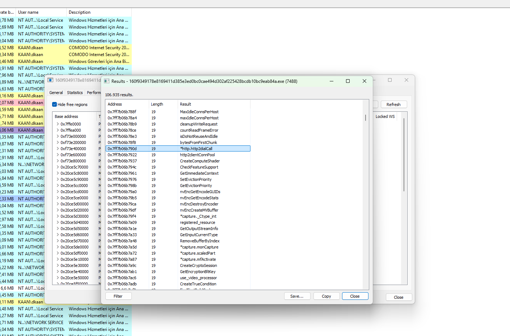

 ## 1. HTTP/2 C2 Channel & Encrypted Screen Capture

Process Hacker's memory string scan of the Overlord RAT (PID 7488) reveals a large set of Windows API calls and internal strings resolved at runtime. Among these, http2dialCall stands out as an HTTP/2-based callback routine used to establish C2 communication. The presence of crypto, input-capture, and graphics-related APIs indicates a fully-featured RAT with keylogging, screen capture, and encrypted C2 capabilities.

### Key Observations:

**http2dialCall** – HTTP/2 callback function; used to open the C2 channel over HTTP/2 (port 443), blending with legitimate HTTPS traffic.
**http2clientConnPool** – Connection pool for HTTP/2 C2 sessions; enables persistent, multiplexed communication with the C2 server.
**maxIdleConnsPerHost** / **GetEvictionPriority** / **SetEvictionPriority** – Connection lifecycle management, keeps idle C2 channels alive while evading timeouts.
**CreateCryptoSession** /**GetEncryptionBltKey** – DirectX/GPU-based crypto session creation; used for encrypted screen capture or GPU-accelerated operations.
**capture._Ctype_int** / **capture.monCapture** / **capture.scaledPart** / **capture.mfActivate** – Screen capture and desktop monitoring routines.
**GetInputCurrentType** / **GetImmediateContext** – Input and rendering context retrieval; supports keylogging and screen scraping.
**CreateTrueColorCondition** – Display condition setup for screen capture operations.

### Why This Matters:

**HTTP/2 C2**: Using http2dialCall and http2clientConnPool shows the RAT communicates over HTTP/2, which is harder to detect than plain HTTP and blends with modern web traffic.
**Encrypted Exfiltration**: CreateCryptoSession and GetEncryptionBltKey indicate encrypted data transfer, likely for stolen files or screenshots.
**Full RAT Capability**: Screen capture (*capture.*) + input capture (GetInputCurrentType) = keylogging and remote surveillance.
**Living-off-the-Land Style**: Runtime resolution of API strings (obfuscated storage) is a common evasion technique to defeat static string analysis.
**Persistence & Evasion**: Connection pool management (maxIdleConnsPerHost, GetEvictionPriority) keeps C2 channels stable while avoiding detection.

### Visual Reference:

## 2.WebSocket C2 Fallback & Keylogging Capabilities

A second string scan of the same Overlord RAT process,reveals a distinct set of strings related to input capture, WebSocket C2, and memory/reflection manipulation. Unlike the first set which focused on HTTP/2 and screen capture, this set points to keylogging, persistent WebSocket communication, and in-memory execution techniques.

### Key Observations:

**capture.rawWin** – Raw window capture routine; used for screenshotting active windows.
**captureKeyStrokes** – Direct keylogging function; captures every keystroke typed on the victim machine.
**map[uintptr]bool** – Runtime map structure; likely used to track hooked APIs or captured handles.
**websocket.noCopy** / **websocket.header** / **websocket.opcode** – WebSocket implementation strings; indicate the RAT uses WebSocket as a secondary C2 channel (in addition to HTTP/2).
**writeFramePayload**/ **readCloseFrameErr** / **setCloseErrLocked** – WebSocket frame handling; confirms active WebSocket-based C2 communication.
**reflectlite.Type** / **abi.UncommonType**/ **abi.PCLnTabMagic** – Go runtime reflection/ABI strings; indicate the payload is a Go-based binary using reflection.
**msgpack.isZeroer** / **msgpack.field** – MessagePack serialization; used to pack/unpack C2 messages efficiently.
**sync.poolDequeue** / **poolLocalInternal** – Go sync pool management; used for high-performance memory reuse.

### Why This Matters:

**Dual C2 Channels**: HTTP/2 (http2dialCall) + WebSocket (*websocket.*) = redundant C2 with automatic failover if one channel is blocked.
**Keylogging Capability**: captureKeyStrokes confirms the RAT performs active keystroke capture — credentials, chats, and passwords are at risk.
**Go-Based Payload**: reflectlite, abi.PCLnTabMagic, and msgpack strings reveal this is a Go-compiled RAT, which is harder to reverse and often bypasses AV signatures.
**MessagePack Serialization**: *msgpack.* indicates compact binary C2 messaging, reducing network footprint and evading DPI.
**In-Memory Reflection**: *reflectlite.Type and *abi.UncommonType are used for dynamic function resolution — a common evasion to avoid static imports.
**Stealthy WebSocket C2**: WebSocket traffic over port 443 blends with legitimate web apps, making detection by network monitoring harder.

### Visual Reference:

## 3.Binary Ninja – Keylogger Module & Agent Command Strings

The dumped binary connectstart.bin (extracted from the Process Hacker memory strings of the Overlord RAT process) was loaded into Binary Ninja for static analysis. The string view reveals a fully structured keylogger module embedded in the payload, along with a clear agent command namespace (overlord-client/cmd/agent/keylogger.*). This confirms that Overlord RAT ships with a modular agent architecture where the keylogger is a dedicated subsystem controlled via C2 commands.

### Key Observations:

**Module Path**: overlord-client/cmd/agent/keylogger.* – clear Go package namespace for the keylogger agent.
(**Keylogger**).Start/ .Stop – starts and stops the keylogger on C2 command.
(**Keylogger**).IsRunning – checks if the keylogger is already active.
(**Keylogger**).captureLoop – main loop that continuously captures keystrokes.
(**Keylogger*).logKey – raw keystroke capture function.
(**Keylogger**).getWindowTitle – grabs the active window title (context for each keystroke).
(**Keylogger**).flushBuffer / .flushLoop / .FlushNow – periodic flushing of captured keystrokes to disk or C2.
(**Keylogger**).ListFiles / .ReadFile / .DeleteFile / .ClearAll
(**Keylogger**).rotateFile / .cleanupOldLogs – log rotation and cleanup to avoid detection.

### Why This Matters:

**Modular Agent Architecture**: The overlord-client/cmd/agent/ path shows a clean, modular Go agent — each capability (keylogger, screen capture, shell, etc.) is a separate command module.
**Active Keylogging**: captureLoop, logKey, and getWindowTitle confirm real-time keystroke capture with window context (usernames, passwords, chats).
**Anti-Forensics**: rotateFile, cleanupOldLogs, and DeleteFile prevent log accumulation and reduce forensic traces.
**Evasion via ROT13**: rot13 string shows captured data is obfuscated before storage/exfiltration to defeat string-based detection.
**Permission Gating**: NeedsPermissionGate / RequestPermission suggest the RAT verifies environment conditions (UAC, admin rights) before activating the keylogger.
**Command-Driven Behavior**: Start/Stop/IsRunning prove the keylogger is remotely toggled by the C2 — not auto-run, which reduces detection footprint.

### Visual Reference:

## 4.Binary Ninja – Browser Injection & Process Manipulation Module

A second string view of the same connectstart.bin dump in Binary Ninja reveals the browser injection subsystem of the Overlord RAT. The package path overlord-client/cmd/agent/capture.* contains functions for enabling debug privileges, monitoring crashes, injecting into browsers, and managing browser processes. This confirms that Overlord RAT does not only keylog — it actively injects code into installed browsers to intercept credentials, sessions, and web traffic.

### Key Observations:

**Module Path**: overlord-client/cmd/agent/capture.* – dedicated capture/injection agent.
**capture.enableDebugPrivilege** – enables SeDebugPrivilege to access and inject into other processes.
syscall.(**LazyDLL**).NewProc – dynamically resolves Windows APIs (LazyDLL) to evade static imports.
**capture.StartbackstageBrowserInjected** – main routine that injects the RAT into browser processes.
**StartbackstageBrowserInjected**.func1 … func24 – multiple helper functions (24+) supporting the injection chain.
**capture.CheckInstalledBrowsers** – enumerates installed browsers (Chrome, Edge, Firefox, Brave, etc.).
**capture.findBrowserExe** – locates the browser executable path.

### Why This Matters:

**Browser Credential Theft**: StartbackstageBrowserInjected proves the RAT injects into browsers to steal saved passwords, cookies, and active sessions.
**SeDebugPrivilege Abuse**: enableDebugPrivilege is a classic technique to gain PROCESS_ALL_ACCESS over other processes for injection.
**Dynamic API Resolution**: LazyDLL.NewProc resolves Windows API calls at runtime, defeating static import-based detection.
**Broad Browser Coverage**: CheckInstalledBrowsers + findBrowserExe suggest support for multiple browsers, not just one.
**Forced Re-Injection**: isProcessRunning + killProcess show the RAT can kill and re-inject if the browser restarts.
**Stability & Anti-Crash**: monitorProcessCrash and describeExitCode ensure injected browsers don't crash frequently (which would raise suspicion).

### Visual Reference:

## 5.Binary Ninja – Process Injection & Reflective DLL Loading

A further string view of connectstart.bin in Binary Ninja exposes the injection engine of the Overlord RAT. The overlord-client/cmd/agent/capture.* package contains a complete process-injection toolkit: suspended process creation, environment block spoofing, reflective DLL injection, and browser API patching. This section proves the RAT is not just a keylogger — it is a fully capable code injection framework.

### Key Observations:

**capture.createSuspendedProcessOnDesktop** – creates a target process in a suspended state for injection.
**capture.buildEnvironmentBlock** / .readRawEnvironmentBlock / .appendEnvironmentOverrides – crafts a fake environment block to mislead EDR tools.
**capture.environmentBlockEntries** / capture.isRDIEnvironmentEntry – checks for reflective DLL injection (RDI) markers in the environment.
**capture.injectIntoProcess** – main injection dispatcher.
**capture.stageInjectionDLL** – stages the payload DLL for injection.
**capture.loadLibraryInject** – classic LoadLibrary-based injection.
**capture.reflectiveInject** / .**findReflectiveLoaderOffset** / .**isBackstageLoaderExport** – reflective DLL injection that loads the payload entirely from memory (no disk artifact).

### Why This Matters:

**Reflective DLL Injection**: reflectiveInject + findReflectiveLoaderOffset mean the payload never touches disk — a strong anti-forensic technique.
**Environment Block Spoofing**: buildEnvironmentBlock and appendEnvironmentOverrides are used to hide the injected process from EDR telemetry.
**Direct Syscalls**: callSyscallN bypasses user-mode API hooks (EDR/AV) by invoking kernel syscalls directly.
**Browser-Specific Hooking**: patchOperaAsync and patchGetCursorInfo show targeted manipulation of browser internals to steal data silently.
**UI Automation Abuse**: iuiAutomation.is used to read browser UI elements directly (address bar, password fields, autofill).
**Suspended Process Trick**: Creating the target suspended prevents the browser from initializing security checks before injection.

### Visual Reference:

## Conclusion

The analysis of the Overlord RAT sample reveals a fully-featured, Go-based Remote Access Trojan built with a modular agent architecture and advanced evasion techniques. Across five analysis stages — memory string inspection, binary static analysis, and injection engine review — the RAT demonstrated capabilities far beyond a simple keylogger.

### Key Takeaways:

**Multi-Channel C2**: HTTP/2 (http2dialCall, http2clientConnPool) as the primary channel and WebSocket (*websocket.*) as a fallback, allowing automatic failover if one channel is blocked.
**Encrypted Communication**: CreateCryptoSession and GetEncryptionBltKey confirm that C2 traffic and exfiltrated data are encrypted, blending with legitimate HTTPS traffic on port 443.
**Keylogging Module**: overlord-client/cmd/agent/keylogger.* contains a dedicated keylogger with captureLoop, logKey, getWindowTitle, log rotation, and ROT13 obfuscation.
**Browser Injection**: StartbackstageBrowserInjected and CheckInstalledBrowsers show the RAT injects into multiple browsers to steal credentials, cookies, and active sessions.
**Process Injection Engine**: reflectiveInject, loadLibraryInject, createSuspendedProcessOnDesktop, and callSyscallN provide stealthy in-memory execution and EDR bypass via direct syscalls.
**Privilege Escalation**: enableDebugPrivilege and LazyDLL.NewProc allow the RAT to obtain SeDebugPrivilege and resolve APIs dynamically, defeating static analysis.
**Anti-Forensics**: rotateFile, cleanupOldLogs, and DeleteFile minimize on-disk traces, while reflective loading keeps the payload entirely in memory.

### Overall Assessment:

Overlord RAT is a mature, multi-stage Go malware designed for credential theft, surveillance, and persistent C2 communication. Its use of LOLBins (AnyDesk), reflective DLL injection, direct syscalls, and dual-channel C2 makes it highly evasive against traditional AV and EDR solutions. The modular overlord-client/cmd/agent/ structure suggests an actively maintained framework with pluggable capabilities, positioning it as a serious threat in targeted attacks.

### Sample Download

The analyzed OverlordRat sample is available on MalwareBazaar for those who wish to conduct their own analysis:

**[OverlordRat Sample on MalwareBazaar](https://bazaar.abuse.ch/sample/160f9349178e8169411d385e3ed0bc0cae494d302af225428bcdb10bc9eab84a/)

**Tools Used:** Process Hacker, Binary Ninja,x64dbg

